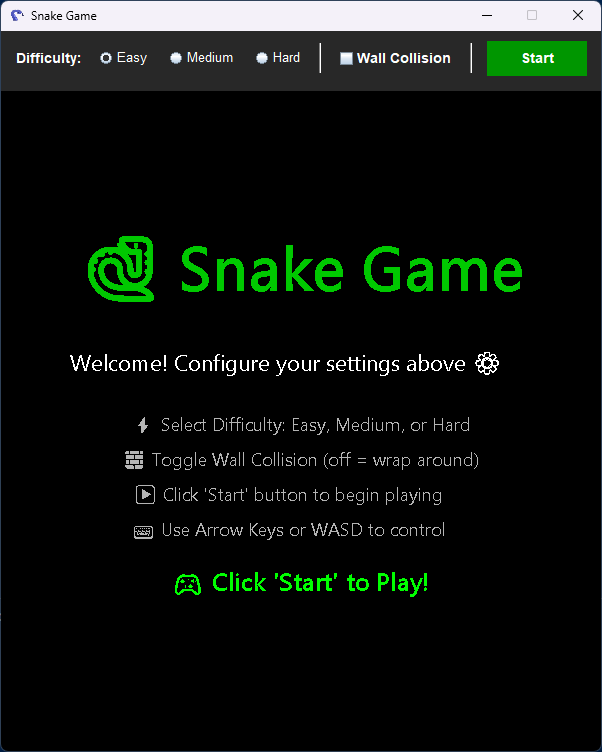
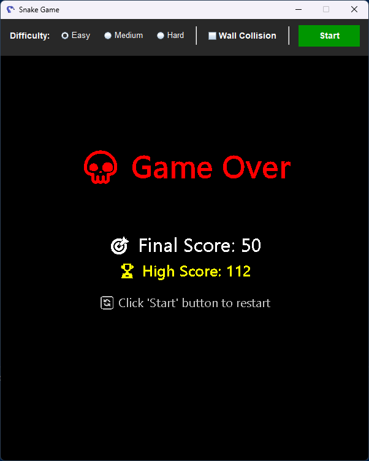

# 🐍 Snake Game - Java Edition

A modern, feature-rich Snake Game built with Java Swing, featuring multiple difficulty levels, special food varieties, high score tracking, and emoji support!

## 📸 Screenshots


*Welcome screen with game instructions*


*Active gameplay with special food and score tracking*


*Game over screen showing final score and high score*

## 🎮 Download & Play

### Quick Start (Windows)
**[Download SnakeGame.exe](https://github.com/bibekchandsah/snake-game/releases/latest/download/SnakeGame.exe)** 

Simply download and double-click to play! No installation required.

*Note: Requires Java Runtime Environment (JRE) 8 or higher installed on your system.*

### Alternative Download
- **[Download SnakeGame.jar](https://github.com/bibekchandsah/snake-game/releases/latest)** - Run with: `java -jar SnakeGame.jar`

## 📋 System Requirements

- **Operating System:** Windows 7/8/10/11, Linux, or macOS
- **Java:** JRE 8 or higher ([Download Java](https://www.java.com/download/))
- **RAM:** 256 MB minimum
- **Disk Space:** 50 MB
- **Display:** 800x600 resolution or higher

## 📸 Features

### 🎮 Gameplay Features
- **Classic Snake Gameplay** - Control the snake, eat food, and grow longer
- **Smooth Controls** - Responsive arrow key controls
- **Multiple Difficulty Levels** - Easy, Medium, and Hard modes with adjustable speeds
- **Wall Collision Toggle** - Choose between classic mode (walls kill) or wrap-around mode
- **Pause/Resume** - Pause the game anytime with the Pause button

### 🍎 Food Varieties
1. **🍎 Normal Apple (Red)** - Worth 1 point
2. **⭐ Golden Apple (Gold)** - Worth 5 points, appears every 15 seconds
3. **💎 Bonus Diamond (Purple)** - Worth 3 points, disappears after 5 seconds!
4. **⚡ Speed Boost (Blue)** - Worth 1 point + 40% speed increase for 5 seconds

### 🏆 Score System
- **Real-time Score Display** - Track your current score
- **High Score Tracking** - Automatically saves your best score
- **Persistent Storage** - High scores saved between game sessions
- **New High Score Celebration** - Special notification when you break records

### 🎨 Visual Features
- **Clean UI** - Dark theme with colorful elements
- **Emoji Support** - Full emoji rendering for food and messages
- **Glow Effects** - Special foods have glowing auras
- **Score Panel** - Dedicated panel below game board showing stats
- **Countdown Timers** - Visual timer for bonus food and speed boosts

## 🚀 How to Run

### Option 1: Run the Executable (Easiest - Windows Only)
1. **Download** `SnakeGame.exe` from [Releases](https://github.com/bibekchandsah/snake-game/releases/latest)
2. **Double-click** the downloaded file
3. **Play!** 🎮

### Option 2: Run the JAR File (All Platforms)
1. Make sure Java is installed: `java -version`
2. Download `SnakeGame.jar` from [Releases](https://github.com/bibekchandsah/snake-game/releases/latest)
3. Run: `java -jar SnakeGame.jar`

### Option 3: Build from Source

#### Prerequisites
- Java Development Kit (JDK) 8 or higher
- Git (optional)

#### Clone Repository
```bash
git clone https://github.com/bibekchandsah/snake-game.git
cd snake-game
```

#### Compilation
```bash
javac SnakeGame.java GamePanel.java SettingsPanel.java HighScoreManager.java Food.java
```

#### Run
```bash
java SnakeGame
```

#### Build Executable (Windows)
See [BUILD.md](BUILD.md) for detailed instructions on creating the EXE file.

## 🎯 How to Play

### Controls
- **⬆️ Up Arrow / W** - Move Up
- **⬇️ Down Arrow / S** - Move Down
- **⬅️ Left Arrow / A** - Move Left
- **➡️ Right Arrow / D** - Move Right

*Supports both Arrow Keys and WASD keys for movement!*

### Game Rules
1. Click the **Start** button to begin
2. Use arrow keys to control the snake
3. Eat food to grow and earn points
4. Avoid hitting yourself (self-collision = game over)
5. If wall collision is enabled, avoid hitting walls

### Settings
- **Difficulty Levels:**
  - 🟢 **Easy** - 150ms delay (slower, easier to control)
  - 🟡 **Medium** - 100ms delay (moderate speed)
  - 🔴 **Hard** - 50ms delay (fast-paced challenge)

- **Wall Collision:**
  - ✅ **ON** - Snake dies when hitting walls (classic mode)
  - ⬜ **OFF** - Snake wraps to opposite side (endless mode)

## 📁 Project Structure

```
snake-game/
├── SnakeGame.java          # Main application entry point
├── GamePanel.java          # Core game logic and rendering
├── SettingsPanel.java      # UI controls (difficulty, settings, buttons)
├── HighScoreManager.java   # High score persistence manager
├── Food.java              # Food types and properties
├── icon.ico               # Application icon
├── highscore.dat          # Saved high score (auto-generated)
├── preview1.png           # Welcome screen screenshot
├── preview2.png           # Gameplay screenshot
├── preview3.png           # Game over screenshot
├── README.md              # This file
└── BUILD.md               # Build instructions for EXE
```

## 🎯 Releases

Download the latest version from the [Releases](https://github.com/bibekchandsah/snake-game/releases) page:

- **SnakeGame.exe** - Windows executable with custom icon
- **SnakeGame.jar** - Cross-platform JAR file
- **Source code** - ZIP and TAR.GZ archives

## 🛠️ Technical Details

### Technologies Used
- **Java** - Core programming language
- **Java Swing** - GUI framework
- **AWT Graphics** - 2D graphics rendering
- **Timer** - Game loop mechanism
- **File I/O** - High score persistence

### Key Classes

#### `SnakeGame.java`
- Main window setup
- Integrates GamePanel and SettingsPanel

#### `GamePanel.java`
- Game board rendering (600x600 pixels)
- Snake movement and collision detection
- Food spawning and management
- Score tracking and display

#### `SettingsPanel.java`
- Difficulty selection (radio buttons)
- Wall collision toggle (checkbox)
- Start/Pause/Resume button
- Auto-updates button states

#### `HighScoreManager.java`
- Loads high score from file on startup
- Saves new high scores automatically
- Persistent storage using `highscore.dat`

#### `Food.java`
- Four food types with different properties
- Point values and visual effects
- Timed expiration for bonus food
- Speed boost functionality

## 🎨 Color Scheme

- **Background:** Black (#000000)
- **Snake Head:** Bright Green (#00FF00)
- **Snake Body:** Dark Green (#2DB400)
- **Grid:** Dark Gray (#191919)
- **Normal Food:** Red (#FF0000)
- **Golden Food:** Gold (#FFD700)
- **Bonus Food:** Purple (#8A2BE2)
- **Speed Food:** Deep Sky Blue (#00BFFF)
- **High Score:** Yellow (#FFFF00)
- **Score Panel:** Dark Gray (#1E1E1E)

## 📊 Scoring

| Food Type | Points | Frequency | Duration | Effect |
|-----------|--------|-----------|----------|--------|
| 🍎 Normal Apple | 1 | Common | Permanent | None |
| ⭐ Golden Apple | 5 | Every 15s | Permanent | None |
| 💎 Bonus Diamond | 3 | Every 20s | 5 seconds | Disappears |
| ⚡ Speed Boost | 1 | 10% chance | Permanent | +40% speed for 5s |

## 🎯 Game Strategy Tips

1. **Focus on Survival** - Don't rush for golden apples if it's risky
2. **Plan Your Route** - Think ahead to avoid trapping yourself
3. **Use Wrap Mode** - Disable wall collision for easier gameplay
4. **Speed Boosts** - Be extra careful when speed boost is active
5. **Bonus Food** - Rush for purple diamonds before they vanish!
6. **High Scores** - Try different difficulty levels to maximize points

## 🐛 Known Limitations

- Game speed doesn't progressively increase with score
- No sound effects or background music
- Single-player only
- Fixed board size (600x600)

## 🚀 Future Enhancements (Planned)

- [ ] Sound effects and background music
- [ ] Progressive difficulty (auto-speed increase)
- [ ] Multiple themes/skins
- [ ] Leaderboard with top 10 scores
- [ ] Obstacles and maze mode
- [ ] Two-player mode
- [ ] Achievement system
- [ ] Game statistics tracking
- [ ] Mobile/touch controls support

## 📝 Version History

### Version 1.0 (Current)
- ✅ Classic snake gameplay
- ✅ Three difficulty levels
- ✅ Wall collision toggle
- ✅ High score system with file persistence
- ✅ Four food varieties with special effects
- ✅ Emoji support
- ✅ Pause/Resume functionality
- ✅ Welcome screen
- ✅ Score panel below game board

## 👨‍💻 Development

### Compilation Requirements
- JDK 8+ (for lambda expressions)
- Supports emoji rendering on Windows (Segoe UI Emoji font)

### File Structure
All `.java` files should be in the same directory for compilation.

## 📄 License

This is a learning project. Feel free to use, modify, and distribute as needed.

## 🤝 Contributing

Feel free to fork this project and add your own features! Some ideas:
- Add sound effects
- Create new food types
- Implement power-ups
- Add multiplayer support
- Create custom themes

## 🎮 Enjoy Playing!

Have fun playing the Snake Game! Try to beat your high score and master all difficulty levels! 🐍🏆

---

**Made with ❤️ using Java Swing**

*Last Updated: November 15, 2025*
